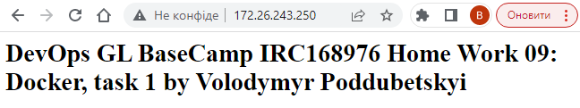
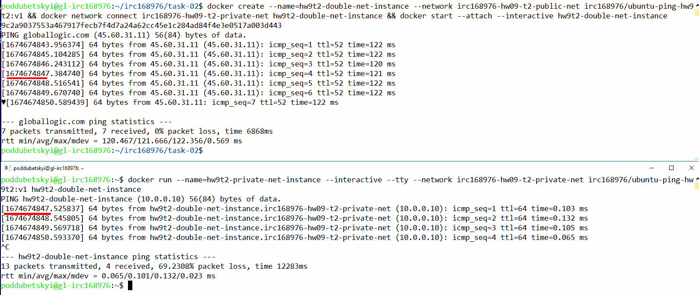

# IRC168976 DevOps GL BaseCamp homework 09. Docker
## Task 1
1) Install docker
   1) The environment: an Ubuntu Linux virtual machine that is running under Windows 10 and built-in Hyper-V virtualization software
      - Linux VM IP: `172.26.243.250`
   2) Find out what Linux distribution the docker engine will be installed on
      - The command:
        ```bash
        uname -a
        ```
      - The output:
        ```
        Linux gl-irc168976 5.4.0-131-generic #147-Ubuntu SMP Fri Oct 14 17:07:22 UTC 2022 x86_64 x86_64 x86_64 GNU/Linux
        ```
   3) [Install Docker Engine on Ubuntu](https://docs.docker.com/engine/install/ubuntu/)
      1) Uninstall old versions
         - The command:
           ```bash
           sudo apt-get remove docker docker-engine docker.io containerd runc
           ```
         - The output:
           ```
           [sudo] password for poddubetskyi:
           Reading package lists... Done
           Building dependency tree
           Reading state information... Done
           E: Unable to locate package docker-engine
           ```
         - Retry:
           ```bash
           sudo apt-get remove docker docker.io containerd runc
           ```
         - The output:
           ```
           Reading package lists... Done
           Building dependency tree
           Reading state information... Done
           Package 'docker' is not installed, so not removed
           Package 'containerd' is not installed, so not removed
           Package 'runc' is not installed, so not removed
           Package 'docker.io' is not installed, so not removed
           0 upgraded, 0 newly installed, 0 to remove and 17 not upgraded.
           ```
      2) Install using the repository
         1) Set up the repository
            1) Update the apt package index and install packages to allow apt to use a repository over HTTPS:
               - The command:
                 ```bash
                 sudo apt-get update -y && sudo apt-get install -y ca-certificates curl  gnupg lsb-release
                 ```
               - The output: (tl/dr)<details><summary>show anyway</summary>
                 ```
                 Hit:1 http://ua.archive.ubuntu.com/ubuntu focal InRelease
                 Get:2 http://ua.archive.ubuntu.com/ubuntu focal-updates InRelease [114 kB]
                 Get:3 http://ua.archive.ubuntu.com/ubuntu focal-backports InRelease [108 kB]
                 Get:4 http://ua.archive.ubuntu.com/ubuntu focal-security InRelease [114 kB]
                 Get:5 http://ua.archive.ubuntu.com/ubuntu focal-updates/main amd64 Packages [2308 kB]
                 Get:6 http://ua.archive.ubuntu.com/ubuntu focal-updates/main Translation-en [399 kB]
                 Get:7 http://ua.archive.ubuntu.com/ubuntu focal-updates/main amd64 c-n-f Metadata [16.2 kB]
                 Get:8 http://ua.archive.ubuntu.com/ubuntu focal-updates/restricted amd64 Packages [1513 kB]
                 Get:9 http://ua.archive.ubuntu.com/ubuntu focal-updates/restricted Translation-en [213 kB]
                 Get:10 http://ua.archive.ubuntu.com/ubuntu focal-updates/restricted amd64 c-n-f Metadata [616 B]
                 Get:11 http://ua.archive.ubuntu.com/ubuntu focal-updates/universe amd64 Packages [1011 kB]
                 Get:12 http://ua.archive.ubuntu.com/ubuntu focal-updates/universe Translation-en [235 kB]
                 Get:13 http://ua.archive.ubuntu.com/ubuntu focal-updates/universe amd64 c-n-f Metadata [23.2 kB]
                 Get:14 http://ua.archive.ubuntu.com/ubuntu focal-updates/multiverse amd64 Packages [25.2 kB]
                 Get:15 http://ua.archive.ubuntu.com/ubuntu focal-updates/multiverse Translation-en [7408 B]
                 Get:16 http://ua.archive.ubuntu.com/ubuntu focal-updates/multiverse amd64 c-n-f Metadata [604 B]
                 Get:17 http://ua.archive.ubuntu.com/ubuntu focal-backports/main amd64 Packages [45.7 kB]
                 Get:18 http://ua.archive.ubuntu.com/ubuntu focal-backports/main amd64 c-n-f Metadata [1420 B]
                 Get:19 http://ua.archive.ubuntu.com/ubuntu focal-backports/universe amd64 Packages [24.9 kB]
                 Get:20 http://ua.archive.ubuntu.com/ubuntu focal-backports/universe Translation-en [16.3 kB]
                 Get:21 http://ua.archive.ubuntu.com/ubuntu focal-backports/universe amd64 c-n-f Metadata [880 B]
                 Get:22 http://ua.archive.ubuntu.com/ubuntu focal-security/main amd64 Packages [1928 kB]
                 Get:23 http://ua.archive.ubuntu.com/ubuntu focal-security/main Translation-en [316 kB]
                 Get:24 http://ua.archive.ubuntu.com/ubuntu focal-security/main amd64 c-n-f Metadata [11.7 kB]
                 Get:25 http://ua.archive.ubuntu.com/ubuntu focal-security/restricted amd64 Packages [1419 kB]
                 Get:26 http://ua.archive.ubuntu.com/ubuntu focal-security/restricted Translation-en [200 kB]
                 Get:27 http://ua.archive.ubuntu.com/ubuntu focal-security/restricted amd64 c-n-f Metadata [616 B]
                 Get:28 http://ua.archive.ubuntu.com/ubuntu focal-security/universe amd64 Packages [780 kB]
                 Get:29 http://ua.archive.ubuntu.com/ubuntu focal-security/universe Translation-en [151 kB]
                 Get:30 http://ua.archive.ubuntu.com/ubuntu focal-security/universe amd64 c-n-f Metadata [16.9 kB]
                 Get:31 http://ua.archive.ubuntu.com/ubuntu focal-security/multiverse amd64 Packages [22.2 kB]
                 Get:32 http://ua.archive.ubuntu.com/ubuntu focal-security/multiverse Translation-en [5464 B]
                 Get:33 http://ua.archive.ubuntu.com/ubuntu focal-security/multiverse amd64 c-n-f Metadata [516 B]
                 Fetched 11.0 MB in 3s (3958 kB/s)
                 Reading package lists... Done
                 Reading package lists... Done
                 Building dependency tree
                 Reading state information... Done
                 lsb-release is already the newest version (11.1.0ubuntu2).
                 lsb-release set to manually installed.
                 gnupg is already the newest version (2.2.19-3ubuntu2.2).
                 gnupg set to manually installed.
                 The following additional packages will be installed:
                   libcurl4
                 The following packages will be upgraded:
                   ca-certificates curl libcurl4
                 3 upgraded, 0 newly installed, 0 to remove and 49 not upgraded.
                 Need to get 537 kB of archives.
                 After this operation, 8192 B disk space will be freed.
                 Get:1 http://ua.archive.ubuntu.com/ubuntu focal-updates/main amd64 ca-certificates all 20211016ubuntu0.20.04.1 [141 kB]
                 Get:2 http://ua.archive.ubuntu.com/ubuntu focal-updates/main amd64 curl amd64 7.68.0-1ubuntu2.15 [161 kB]
                 Get:3 http://ua.archive.ubuntu.com/ubuntu focal-updates/main amd64 libcurl4 amd64 7.68.0-1ubuntu2.15 [235 kB]
                 Fetched 537 kB in 0s (4900 kB/s)
                 perl: warning: Setting locale failed.
                 perl: warning: Please check that your locale settings:
                         LANGUAGE = (unset),
                         LC_ALL = (unset),
                         LANG = "en_US.UTF-8"
                     are supported and installed on your system.
                 perl: warning: Falling back to the standard locale ("C").
                 locale: Cannot set LC_CTYPE to default locale: No such file or directory
                 locale: Cannot set LC_MESSAGES to default locale: No such file or directory
                 locale: Cannot set LC_ALL to default locale: No such file or directory
                 Preconfiguring packages ...
                 (Reading database ... 72799 files and directories currently installed.)
                 Preparing to unpack .../ca-certificates_20211016ubuntu0.20.04.1_all.deb ...
                 Unpacking ca-certificates (20211016ubuntu0.20.04.1) over (20211016~20.04.1) ...
                 Preparing to unpack .../curl_7.68.0-1ubuntu2.15_amd64.deb ...
                 Unpacking curl (7.68.0-1ubuntu2.15) over (7.68.0-1ubuntu2.14) ...
                 Preparing to unpack .../libcurl4_7.68.0-1ubuntu2.15_amd64.deb ...
                 Unpacking libcurl4:amd64 (7.68.0-1ubuntu2.15) over (7.68.0-1ubuntu2.14) ...
                 Setting up ca-certificates (20211016ubuntu0.20.04.1) ...
                 locale: Cannot set LC_CTYPE to default locale: No such file or directory
                 locale: Cannot set LC_MESSAGES to default locale: No such file or directory
                 locale: Cannot set LC_ALL to default locale: No such file or directory
                 Updating certificates in /etc/ssl/certs...
                 rehash: warning: skipping ca-certificates.crt,it does not contain exactly one certificate or CRL
                 0 added, 3 removed; done.
                 Setting up libcurl4:amd64 (7.68.0-1ubuntu2.15) ...
                 Setting up curl (7.68.0-1ubuntu2.15) ...
                 Processing triggers for man-db (2.9.1-1) ...
                 Processing triggers for libc-bin (2.31-0ubuntu9.9) ...
                 Processing triggers for ca-certificates (20211016ubuntu0.20.04.1) ...
                 Updating certificates in /etc/ssl/certs...
                 0 added, 0 removed; done.
                 Running hooks in /etc/ca-certificates/update.d...
                 done.
                 ```
                 </details>
            2) Add Docker’s official GPG key:
               - The command:
                 ```bash
                 sudo mkdir -p /etc/apt/keyrings && \
                 curl -fsSL https://download.docker.com/linux/ubuntu/gpg | \
                 sudo gpg --dearmor -o /etc/apt/keyrings/docker.gpg
                 ```
               - The output: _the command doesn't produce any output_
            3) Use the following command to set up the repository:
               - The command:
                 ```bash
                 echo \
                   "deb [arch=$(dpkg --print-architecture) signed-by=/etc/apt/keyrings/docker.gpg] \
                   https://download.docker.com/linux/ubuntu \
                   $(lsb_release -cs) stable" | \
                   sudo tee /etc/apt/sources.list.d/docker.list > /dev/null
                 ```
               - The output: _the command doesn't produce any output_
          2) Install Docker Engine:
             1) Update the apt package index, Install Docker Engine, containerd, and Docker Compose
                - The command:
                  ```
                  sudo chmod a+r /etc/apt/keyrings/docker.gpg && sudo apt-get update -y -q && \
                  sudo apt-get install -y -q docker-ce docker-ce-cli containerd.io docker-compose-plugin
                  ```
                - The output: (tl/dr)<details><summary>show anyway</summary>
                  ```
                  [sudo] password for poddubetskyi:
                  В кеші:1 http://ua.archive.ubuntu.com/ubuntu focal InRelease
                  В кеші:2 http://ua.archive.ubuntu.com/ubuntu focal-updates InRelease
                  В кеші:3 http://ua.archive.ubuntu.com/ubuntu focal-backports InRelease
                  В кеші:4 http://ua.archive.ubuntu.com/ubuntu focal-security InRelease
                  Отр:5 https://download.docker.com/linux/ubuntu focal InRelease [57,7 kB]
                  Отр:6 https://download.docker.com/linux/ubuntu focal/stable amd64 Packages [23,2 kB]
                  Отримано 80,8 kB за 1сB (79,5 kB/s)
                  Зчитування переліків пакунків...
                  Зчитування переліків пакунків...
                  Побудова дерева залежностей...
                  Зчитування інформації про стан...
                  The following additional packages will be installed:
                    docker-ce-rootless-extras docker-scan-plugin pigz slirp4netns
                  Пропоновані пакунки:
                    aufs-tools cgroupfs-mount | cgroup-lite
                  НОВІ пакунки, які будуть встановлені:
                    containerd.io docker-ce docker-ce-cli docker-ce-rootless-extras docker-compose-plugin docker-scan-plugin pigz slirp4netns
                  оновлено 0, встановлено 8 нових, 0 відмічено для видалення і 22 не оновлено.
                  Необхідно завантажити 113 MB архівів.
                  Після цієї операції об'єм зайнятого дискового простору зросте на 431 MB.
                  Отр:1 http://ua.archive.ubuntu.com/ubuntu focal/universe amd64 pigz amd64 2.4-1 [57,4 kB]
                  Отр:2 http://ua.archive.ubuntu.com/ubuntu focal/universe amd64 slirp4netns amd64 0.4.3-1 [74,3 kB]
                  Отр:3 https://download.docker.com/linux/ubuntu focal/stable amd64 containerd.io amd64 1.6.15-1 [27,7 MB]
                  Отр:4 https://download.docker.com/linux/ubuntu focal/stable amd64 docker-ce-cli amd64 5:20.10.23~3-0~ubuntu-focal [42,6 MB]
                  Отр:5 https://download.docker.com/linux/ubuntu focal/stable amd64 docker-ce amd64 5:20.10.23~3-0~ubuntu-focal [20,5 MB]
                  Отр:6 https://download.docker.com/linux/ubuntu focal/stable amd64 docker-ce-rootless-extras amd64 5:20.10.23~3-0~ubuntu-focal [8 395 kB]
                  Отр:7 https://download.docker.com/linux/ubuntu focal/stable amd64 docker-compose-plugin amd64 2.15.1-1~ubuntu.20.04~focal [9 572 kB]
                  Отр:8 https://download.docker.com/linux/ubuntu focal/stable amd64 docker-scan-plugin amd64 0.23.0~ubuntu-focal [3 622 kB]
                  Отримано 113 MB за 41сB (2 725 kB/s)
                  Selecting previously unselected package pigz.
                  (Reading database ... 109234 files and directories currently installed.)
                  Preparing to unpack .../0-pigz_2.4-1_amd64.deb ...
                  Unpacking pigz (2.4-1) ...
                  Selecting previously unselected package containerd.io.
                  Preparing to unpack .../1-containerd.io_1.6.15-1_amd64.deb ...
                  Unpacking containerd.io (1.6.15-1) ...
                  Selecting previously unselected package docker-ce-cli.
                  Preparing to unpack .../2-docker-ce-cli_5%3a20.10.23~3-0~ubuntu-focal_amd64.deb ...
                  Unpacking docker-ce-cli (5:20.10.23~3-0~ubuntu-focal) ...
                  Selecting previously unselected package docker-ce.
                  Preparing to unpack .../3-docker-ce_5%3a20.10.23~3-0~ubuntu-focal_amd64.deb ...
                  Unpacking docker-ce (5:20.10.23~3-0~ubuntu-focal) ...
                  Selecting previously unselected package docker-ce-rootless-extras.
                  Preparing to unpack .../4-docker-ce-rootless-extras_5%3a20.10.23~3-0~ubuntu-focal_amd64.deb ...
                  Unpacking docker-ce-rootless-extras (5:20.10.23~3-0~ubuntu-focal) ...
                  Selecting previously unselected package docker-compose-plugin.
                  Preparing to unpack .../5-docker-compose-plugin_2.15.1-1~ubuntu.20.04~focal_amd64.deb ...
                  Unpacking docker-compose-plugin (2.15.1-1~ubuntu.20.04~focal) ...
                  Selecting previously unselected package docker-scan-plugin.
                  Preparing to unpack .../6-docker-scan-plugin_0.23.0~ubuntu-focal_amd64.deb ...
                  Unpacking docker-scan-plugin (0.23.0~ubuntu-focal) ...
                  Selecting previously unselected package slirp4netns.
                  Preparing to unpack .../7-slirp4netns_0.4.3-1_amd64.deb ...
                  Unpacking slirp4netns (0.4.3-1) ...
                  Setting up slirp4netns (0.4.3-1) ...
                  Setting up docker-scan-plugin (0.23.0~ubuntu-focal) ...
                  Setting up containerd.io (1.6.15-1) ...
                  Created symlink /etc/systemd/system/multi-user.target.wants/containerd.service → /lib/systemd/system/containerd.service.
                  Setting up docker-compose-plugin (2.15.1-1~ubuntu.20.04~focal) ...
                  Setting up docker-ce-cli (5:20.10.23~3-0~ubuntu-focal) ...
                  Setting up pigz (2.4-1) ...
                  Setting up docker-ce-rootless-extras (5:20.10.23~3-0~ubuntu-focal) ...
                  Setting up docker-ce (5:20.10.23~3-0~ubuntu-focal) ...
                  Created symlink /etc/systemd/system/multi-user.target.wants/docker.service → /lib/systemd/system/docker.service.
                  Created symlink /etc/systemd/system/sockets.target.wants/docker.socket → /lib/systemd/system/docker.socket.
                  Processing triggers for man-db (2.9.1-1) ...
                  Processing triggers for systemd (245.4-4ubuntu3.17) ...
                  ```
                  </details>
             2) Verify that the Docker Engine installation is successful by running the `hello-world` image:
                - The command:
                  ```bash
                  docker run hello-world
                  ``` 
                - The output:
                  ```
                  docker: Got permission denied while trying to connect to the Docker daemon socket at unix:///var/run/docker.sock: Post "http://%2Fvar%2Frun%2Fdocker.sock/v1.24/containers/create": dial unix /var/run/docker.sock: connect: permission denied.
                  See 'docker run --help'.
                  ```
             3) Manage Docker as a non-root user:
                1) Check if the `docker` group exists:
                   - The command:
                     ```bash
                     grep 'docker' /etc/group
                     ```
                   - The output:
                     ```
                     docker:x:998:
                     ```
                2) Check if current user is a member of the `docker` group:
                   - The command:
                     ```bash
                     groups ${USER} | grep --count 'docker'
                     ```
                   - The output:
                     ```
                     0
                     ```
                   - The result: **NO, it doesn't**
                3) Add current user to the `docker` group:
                   - The command:
                     ```bash
                     sudo usermod -aG docker $USER
                     ```
                   - The output: _the command doesn't produce any output_
                4) Activate the changes to groups:
                   - The command:
                     ```bash
                     newgrp docker
                     ```
                   - The output: _the command doesn't produce any output_
             4) Retry the verification that the Docker Engine installation is successful by running the `hello-world` image:
                - The command:
                  ```bash
                  docker run hello-world
                  ``` 
                - The output:
                  ```
                  Unable to find image 'hello-world:latest' locally
                  latest: Pulling from library/hello-world
                  2db29710123e: Pull complete
                  Digest: sha256:aa0cc8055b82dc2509bed2e19b275c8f463506616377219d9642221ab53cf9fe
                  Status: Downloaded newer image for hello-world:latest

                  Hello from Docker!
                  This message shows that your installation appears to be working correctly.

                  To generate this message, Docker took the following steps:
                  1. The Docker client contacted the Docker daemon.
                  2. The Docker daemon pulled the "hello-world" image from the Docker Hub.
                      (amd64)
                  3. The Docker daemon created a new container from that image which runs the
                      executable that produces the output you are currently reading.
                  4. The Docker daemon streamed that output to the Docker client, which sent it
                      to your terminal.

                  To try something more ambitious, you can run an Ubuntu container with:
                  $ docker run -it ubuntu bash

                  Share images, automate workflows, and more with a free Docker ID:
                  https://hub.docker.com/

                  For more examples and ideas, visit:
                  https://docs.docker.com/get-started/

                  ```
                - The result: **SUCCESSFULL**

2) Prepare a dockerfile based on Apache or Nginx image, add your own index.html page with your name and surname to the docker image:
      1) The contents of the `Dockerfile` are as follows below. The Apache [httpd image](https://hub.docker.com/_/httpd) is chosen as the base for building the custom image.
         ```Dockerfile
         FROM library/httpd:latest
         LABEL org.opencontainers.artifact.description='IRC168976 DevOps GL BaseCamp homework 09. Docker. Task 01'
         LABEL org.opencontainers.image.authors='Volodymyr Poddubetskyi'
         RUN /bin/sed -i 's/^Listen 80$/Listen 8080/' /usr/local/apache2/conf/httpd.conf
         EXPOSE 8080
         WORKDIR /usr/local/apache2/htdocs
         ADD ./index.html ./

         ```
      2) The build context:
         - The command:
           ```bash
           ls -1
           ```
         - The output:
           ```
           Dockerfile
           index.html
           ```
      3) The contents of the `index.html` file are as follows:
         ```html
         <html>
           <head>
             <title>DevOps GL BaseCamp IRC168976 Home Work 09: Docker, task 1</title>
           </head>
           <body>
             <h1>DevOps GL BaseCamp IRC168976 Home Work 09: Docker, task 1 by Volodymyr Poddubetskyi</h1>
           </body>
         </html>
         ```
      4) Build the image:
         - The command:
           ```bash
           docker build --file 'Dockerfile' --tag 'irc168976/httpd-hw9t1:v1' ./
           ```
         - The output: (tl/dr)<details><summary>show anyway</summary>
           ```
           Sending build context to Docker daemon  3.072kB
           Step 1/7 : FROM library/httpd:latest
           latest: Pulling from library/httpd
           8740c948ffd4: Pull complete
           70698c657149: Pull complete
           00df85967755: Pull complete
           ec2ee6bdcb58: Pull complete
           8b4456c99d44: Pull complete
           Digest: sha256:87a012bf99bf5e3e0f628ac1f69abbeab534282857fba3a359ca3a3f4a02429a
           Status: Downloaded newer image for httpd:latest
           ---> 6e794a483258
           Step 2/7 : LABEL org.opencontainers.artifact.description='IRC168976 DevOps GL BaseCamp homework 09. Docker. Task 01'
           ---> Running in fdcc2a11d65e
           Removing intermediate container fdcc2a11d65e
           ---> 514214ae88fd
           Step 3/7 : LABEL org.opencontainers.image.authors='Volodymyr Poddubetskyi'
           ---> Running in 933f1f3c9ae8
           Removing intermediate container 933f1f3c9ae8
           ---> 6b561ce70ac5
           Step 4/7 : RUN /bin/sed -i 's/^Listen 80$/Listen 8080/' /usr/local/apache2/conf/httpd.conf
           ---> Running in ca43be297cd4
           Removing intermediate container ca43be297cd4
           ---> 4b973c69cae6
           Step 5/7 : EXPOSE 8080
           ---> Running in 78ae129e85f7
           Removing intermediate container 78ae129e85f7
           ---> 615773b72790
           Step 6/7 : WORKDIR /usr/local/apache2/htdocs
           ---> Running in 4d9b12f424fc
           Removing intermediate container 4d9b12f424fc
           ---> 4d5d2ac35c20
           Step 7/7 : ADD ./index.html ./
           ---> d92ae1f792f8
           Successfully built d92ae1f792f8
           Successfully tagged irc168976/httpd-hw9t1:v1
           ```
           </details>
         - The result: **SUCCESSFUL** 
3) Run the docker container at port 8080
   - The command:
     ```bash
     docker run --name=httpd-hw9t1-run --interactive --tty --publish 80:8080 irc168976/httpd-hw9t1:v1
     ```
   - The output:
     ```
     AH00558: httpd: Could not reliably determine the server's fully qualified domain name, using 172.17.0.2. Set the 'ServerName' directive globally to suppress this message
     AH00558: httpd: Could not reliably determine the server's fully qualified domain name, using 172.17.0.2. Set the 'ServerName' directive globally to suppress this message
     [Wed Jan 25 11:04:08.663158 2023] [mpm_event:notice] [pid 1:tid 140334342532416] AH00489: Apache/2.4.55 (Unix) configured -- resuming normal operations
     [Wed Jan 25 11:04:08.664556 2023] [core:notice] [pid 1:tid 140334342532416] AH00094: Command line: 'httpd -D FOREGROUND'     
     ```
4) Open page in Web Browser:
   - The browser window screenshot:
     
   - The container additional output:
     ```
     172.26.240.1 - - [25/Jan/2023:11:05:53 +0000] "GET / HTTP/1.1" 200 228
     ```
5) Clean up local containers and images:
   - The command:
     ```bash
     docker container ls -a -q | xargs docker rm && \
     docker image ls -a -q | xargs docker rm
     ```
   - The output: (tl/dr)<details><summary>show anyway</summary>
     ```
     6f6799b64224
     Untagged: irc168976/httpd-hw9t1:v1
     Deleted: sha256:d92ae1f792f8f0ae81d978cbc436493e00d4212bca7862ff9b3d1befdccb0d52
     Deleted: sha256:7d36258e573097714b537117679afa561b8338849b2c027948d9e75c7c8c6024
     Deleted: sha256:4d5d2ac35c203e74f0a99d73c92894f6f6c095a2de6ddea1d8a45cb1af78d9da
     Deleted: sha256:615773b727907e8f8258724afb777e6c22eb1b394dba3261b1b4d6bab8a81660
     Deleted: sha256:4b973c69cae6303e11667e76d3ec1cf55216c043b38ff31a9ba866506d56154b
     Deleted: sha256:535259da869636ff9f2c9205f8411f58267722c64b0a186fc4a169a6c0149bf4
     Deleted: sha256:6b561ce70ac540cbd72d6d4759562d058eff8b8e02225630d6617491a1f05b36
     Deleted: sha256:514214ae88fd68fff25f2fb3881d1ff4d1eb721718753bf619a2395beb40c6e2
     Untagged: httpd:latest
     Untagged: httpd@sha256:87a012bf99bf5e3e0f628ac1f69abbeab534282857fba3a359ca3a3f4a02429a
     Deleted: sha256:6e794a4832588ca05865700da59a3d333e7daaaf0544619e7f326eed7e72c903
     Deleted: sha256:8aa731fec5f9fa7e35c83b39747dd4800e11ece5a4a356039212687314c1249b
     Deleted: sha256:f16f8ec324bb7acbe8bb034aa25d79cf4d782ef53a7c70446fb0994b251769b3
     Deleted: sha256:d70badffc2c173b5781391ad9196ec216db33ac628962a68d6c6e674dbedab5f
     Deleted: sha256:f3f967e53184f3542045e44fb38fc1ec70a31a0dafefb2ec763bf9f704f0e1ce
     Deleted: sha256:67a4178b7d47beb6a1f697a593bd0c6841c67eb0da00f2badefb05fd30671490
     Error response from daemon: conflict: unable to delete 4b973c69cae6 (cannot be forced) - image has dependent child images
     Error response from daemon: conflict: unable to delete 615773b72790 (cannot be forced) - image has dependent child images
     Error response from daemon: conflict: unable to delete 4d5d2ac35c20 (cannot be forced) - image has dependent child images
     Error: No such image: 514214ae88fd
     Error: No such image: 6b561ce70ac5
     ```
     </details>
6) Report save in GitHub repository
   - This document was created as a result of processing the 6th step.

## Task 2
1) Prepare private and public network:
   1) The private network:
      - The command:
        ```bash
        docker network create \
          --driver=bridge \
          --subnet='10.0.0.8/29' \
          --ip-range='10.0.0.8/29' \
          --gateway='10.0.0.9' \
          --internal=true \
          'irc168976-hw09-t2-private-net'
        ```
      - The output:
        ```
        1c4d961aab89e2b9fbbf790230d63aba8e7dcd67264d38581bf83edc521e19e8
        ```
   2) The public network:
      - The command:
        ```bash
        docker network create \
          --driver=bridge \
          --subnet='10.0.0.0/29' \
          --ip-range='10.0.0.0/29' \
          --gateway='10.0.0.1' \
          'irc168976-hw09-t2-public-net'
        ```
      - The output:
        ```
        d633d500139da7e149d2878370830177c105d06ec4e32ad01d40554855501a0a
        ```
   3) Show the list of cretaed networks:
      - The command:
        ```bash
        docker network ls --filter 'name=irc1'
        ```
      - The output:
        ```
        NETWORK ID     NAME                            DRIVER    SCOPE
        1c4d961aab89   irc168976-hw09-t2-private-net   bridge    local
        d633d500139d   irc168976-hw09-t2-public-net    bridge    local
        ```
2) Prepare one dockerfile based on ubuntu with the ping command:
   1) The contents of the `Dockerfile` are as follows below.
      ```Dockerfile
      FROM library/ubuntu:latest
      LABEL org.opencontainers.artifact.description='IRC168976 DevOps GL BaseCamp homework 09. Docker. Task 02'
      LABEL org.opencontainers.image.authors='Volodymyr Poddubetskyi'
      RUN apt update -y -q && apt install iputils-ping -y -q && apt autoremove -y -q && apt clean -y -q
      ENTRYPOINT [ "/usr/bin/ping","-D" ]
      CMD [ "globallogic.com" ]
      
      ```
      The `-D` option for the `ping` tool is used to print timestamp (unix time + microseconds as in gettimeofday) before each line.
   2) The build context: there is no build context in this case.
   3) Build the image:
      - The command:
        ```bash
        docker build --tag 'irc168976/ubuntu-ping-hw9t2:v1' - < 'Dockerfile'
        ```
      - The output: (tl/dr)<details><summary>show anyway</summary>
        ```
        Sending build context to Docker daemon  2.048kB
        Step 1/6 : FROM library/ubuntu:latest
        ---> 6b7dfa7e8fdb
        Step 2/6 : LABEL org.opencontainers.artifact.description='IRC168976 DevOps GL BaseCamp homework 09. Docker. Task 02'
        ---> Running in cb42418f18f6
        Removing intermediate container cb42418f18f6
        ---> df3efa17dba5
        Step 3/6 : LABEL org.opencontainers.image.authors='Volodymyr Poddubetskyi'
        ---> Running in 93e52e825249
        Removing intermediate container 93e52e825249
        ---> a01bbfeedc4c
        Step 4/6 : RUN apt update -y -q && apt install iputils-ping -y -q && apt autoremove -y -q && apt clean -y -q
        ---> Running in 323f805b236e

        WARNING: apt does not have a stable CLI interface. Use with caution in scripts.

        Get:1 http://archive.ubuntu.com/ubuntu jammy InRelease [270 kB]
        Get:2 http://archive.ubuntu.com/ubuntu jammy-updates InRelease [114 kB]
        Get:3 http://archive.ubuntu.com/ubuntu jammy-backports InRelease [99.8 kB]
        Get:4 http://security.ubuntu.com/ubuntu jammy-security InRelease [110 kB]
        Get:5 http://archive.ubuntu.com/ubuntu jammy/main amd64 Packages [1792 kB]
        Get:6 http://archive.ubuntu.com/ubuntu jammy/universe amd64 Packages [17.5 MB]
        Get:7 http://security.ubuntu.com/ubuntu jammy-security/restricted amd64 Packages [681 kB]
        Get:8 http://security.ubuntu.com/ubuntu jammy-security/multiverse amd64 Packages [4732 B]
        Get:9 http://security.ubuntu.com/ubuntu jammy-security/universe amd64 Packages [793 kB]
        Get:10 http://security.ubuntu.com/ubuntu jammy-security/main amd64 Packages [740 kB]
        Get:11 http://archive.ubuntu.com/ubuntu jammy/multiverse amd64 Packages [266 kB]
        Get:12 http://archive.ubuntu.com/ubuntu jammy/restricted amd64 Packages [164 kB]
        Get:13 http://archive.ubuntu.com/ubuntu jammy-updates/main amd64 Packages [1057 kB]
        Get:14 http://archive.ubuntu.com/ubuntu jammy-updates/multiverse amd64 Packages [8978 B]
        Get:15 http://archive.ubuntu.com/ubuntu jammy-updates/restricted amd64 Packages [730 kB]
        Get:16 http://archive.ubuntu.com/ubuntu jammy-updates/universe amd64 Packages [999 kB]
        Get:17 http://archive.ubuntu.com/ubuntu jammy-backports/main amd64 Packages [3520 B]
        Get:18 http://archive.ubuntu.com/ubuntu jammy-backports/universe amd64 Packages [7286 B]
        Fetched 25.3 MB in 12s (2093 kB/s)
        Reading package lists...
        Building dependency tree...
        Reading state information...
        4 packages can be upgraded. Run 'apt list --upgradable' to see them.

        WARNING: apt does not have a stable CLI interface. Use with caution in scripts.

        Reading package lists...
        Building dependency tree...
        Reading state information...
        The following additional packages will be installed:
          libcap2-bin libpam-cap
        The following NEW packages will be installed:
          iputils-ping libcap2-bin libpam-cap
        0 upgraded, 3 newly installed, 0 to remove and 4 not upgraded.
        Need to get 76.8 kB of archives.
        After this operation, 280 kB of additional disk space will be used.
        Get:1 http://archive.ubuntu.com/ubuntu jammy/main amd64 libcap2-bin amd64 1:2.44-1build3 [26.0 kB]
        Get:2 http://archive.ubuntu.com/ubuntu jammy/main amd64 iputils-ping amd64 3:20211215-1 [42.9 kB]
        Get:3 http://archive.ubuntu.com/ubuntu jammy/main amd64 libpam-cap amd64 1:2.44-1build3 [7932 B]
        debconf: delaying package configuration, since apt-utils is not installed
        Fetched 76.8 kB in 0s (279 kB/s)
        Selecting previously unselected package libcap2-bin.
        (Reading database ... 4395 files and directories currently installed.)
        Preparing to unpack .../libcap2-bin_1%3a2.44-1build3_amd64.deb ...
        Unpacking libcap2-bin (1:2.44-1build3) ...
        Selecting previously unselected package iputils-ping.
        Preparing to unpack .../iputils-ping_3%3a20211215-1_amd64.deb ...
        Unpacking iputils-ping (3:20211215-1) ...
        Selecting previously unselected package libpam-cap:amd64.
        Preparing to unpack .../libpam-cap_1%3a2.44-1build3_amd64.deb ...
        Unpacking libpam-cap:amd64 (1:2.44-1build3) ...
        Setting up libcap2-bin (1:2.44-1build3) ...
        Setting up libpam-cap:amd64 (1:2.44-1build3) ...
        debconf: unable to initialize frontend: Dialog
        debconf: (TERM is not set, so the dialog frontend is not usable.)
        debconf: falling back to frontend: Readline
        debconf: unable to initialize frontend: Readline
        debconf: (Can't locate Term/ReadLine.pm in @INC (you may need to install the Term::ReadLine module) (@INC contains: /etc/perl /usr/local/lib/x86_64-linux-gnu/perl/5.34.0 /usr/local/share/perl/5.34.0 /usr/lib/x86_64-linux-gnu/perl5/5.34 /usr/share/perl5 /usr/lib/x86_64-linux-gnu/perl-base /usr/lib/x86_64-linux-gnu/perl/5.34 /usr/share/perl/5.34 /usr/local/lib/site_perl) at /usr/share/perl5/Debconf/FrontEnd/Readline.pm line 7.)
        debconf: falling back to frontend: Teletype
        Setting up iputils-ping (3:20211215-1) ...

        WARNING: apt does not have a stable CLI interface. Use with caution in scripts.

        Reading package lists...
        Building dependency tree...
        Reading state information...
        0 upgraded, 0 newly installed, 0 to remove and 4 not upgraded.

        WARNING: apt does not have a stable CLI interface. Use with caution in scripts.

        Removing intermediate container 323f805b236e
        ---> 96a49882b9d2
        Step 5/6 : ENTRYPOINT [ "/usr/bin/ping","-D" ]
        ---> Running in d1c5cfc94972
        Removing intermediate container d1c5cfc94972
        ---> f0d765f8f5e9
        Step 6/6 : CMD [ "globallogic.com" ]
        ---> Running in 08d2833f958d
        Removing intermediate container 08d2833f958d
        ---> 25f4a97f5262
        Successfully built 25f4a97f5262
        Successfully tagged irc168976/ubuntu-ping-hw9t2:v1
        ```
        </details>
3) One container must have access to the private and public networks the second container
must be in the private network
   * A) Run a container that has access to the public network and ping some resources (
example: google.com ):
        1) Set up the double network interfaced container:
           1) Create the container and connect it to the public network:
              - The command:
                ```bash
                docker create --name=hw9t2-double-net-instance \
                  --network irc168976-hw09-t2-public-net \
                  irc168976/ubuntu-ping-hw9t2:v1
                ```
              - The output:
                ```
                23af931e62977201e4c53a9c8c4113bab1c37cc70107cb07525a4f740488f903
                ```
           2) Connect created container to the private network:
              - The command:
                ```bash
                docker network connect irc168976-hw09-t2-private-net hw9t2-double-net-instance
                ```
              - The output: _the command doesn't produce any output_
           3) Prepare the launch command of the second container, that should be connected to the private network only (see the next item of this list), then launch this container:
              - The command:
                ```bash
                docker start \
                  --attach \
                  --interactive \
                  hw9t2-double-net-instance
                ```
              - The output (fragment):
                ```
                PING globallogic.com (45.60.31.11) 56(84) bytes of data.
                [1674674843.956374] 64 bytes from 45.60.31.11 (45.60.31.11): icmp_seq=1 ttl=52 time=122 ms
                [1674674845.104285] 64 bytes from 45.60.31.11 (45.60.31.11): icmp_seq=2 ttl=52 time=122 ms
                [1674674846.243112] 64 bytes from 45.60.31.11 (45.60.31.11): icmp_seq=3 ttl=52 time=120 ms
                [1674674847.384740] 64 bytes from 45.60.31.11 (45.60.31.11): icmp_seq=4 ttl=52 time=121 ms
                [1674674848.516541] 64 bytes from 45.60.31.11 (45.60.31.11): icmp_seq=5 ttl=52 time=122 ms
                [1674674849.670740] 64 bytes from 45.60.31.11 (45.60.31.11): icmp_seq=6 ttl=52 time=122 ms
                ♥[1674674850.589439] 64 bytes from 45.60.31.11: icmp_seq=7 ttl=52 time=122 ms

                --- globallogic.com ping statistics ---
                7 packets transmitted, 7 received, 0% packet loss, time 6868ms
                rtt min/avg/max/mdev = 120.467/121.666/122.356/0.569 ms
                ```
   * B) The second container ping the first container via a private network
        1) In the separate terminal or tty do the launch of the second container that sits in private network only and pass it the double network interfaced container name as the start parameter:
        - The command:
          ```bash
          docker run --name=hw9t2-private-net-instance \
            --interactive \
            --tty \
            --network irc168976-hw09-t2-private-net \
            irc168976/ubuntu-ping-hw9t2:v1 \
            hw9t2-double-net-instance
          ```
        - The output:
          ```
          PING hw9t2-double-net-instance (10.0.0.10) 56(84) bytes of data.
          [1674674847.525837] 64 bytes from hw9t2-double-net-instance.irc168976-hw09-t2-private-net (10.0.0.10): icmp_seq=1 ttl=64 time=0.103 ms
          [1674674848.545805] 64 bytes from hw9t2-double-net-instance.irc168976-hw09-t2-private-net (10.0.0.10): icmp_seq=2 ttl=64 time=0.132 ms
          [1674674849.569718] 64 bytes from hw9t2-double-net-instance.irc168976-hw09-t2-private-net (10.0.0.10): icmp_seq=3 ttl=64 time=0.105 ms
          [1674674850.593370] 64 bytes from hw9t2-double-net-instance.irc168976-hw09-t2-private-net (10.0.0.10): icmp_seq=4 ttl=64 time=0.065 ms
          ^C
          --- hw9t2-double-net-instance ping statistics ---
          13 packets transmitted, 4 received, 69.2308% packet loss, time 12283ms
          rtt min/avg/max/mdev = 0.065/0.101/0.132/0.023 ms
          ```
   The screenshot of the simultaneous operation of both containers:
   
4) Report save in GitHub repository

## Additional commands
1) Remove all images except the specific one:
   ```bash
   docker image ls -a -q ubuntu:latest | \
   join -v 2 -j 1 -i - <(docker image ls -a -q | sort) | \
   xargs docker image rm
   ```
2) Stop and remove all containers then remove all images:
   ```
   docker container ls -q | xargs docker stop ; \
   docker container ls -a -q | xargs docker rm && \
   docker image ls -a -q | xargs docker image rm
   ```